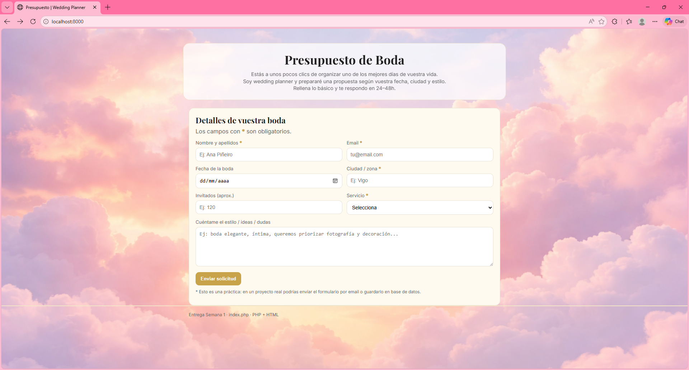
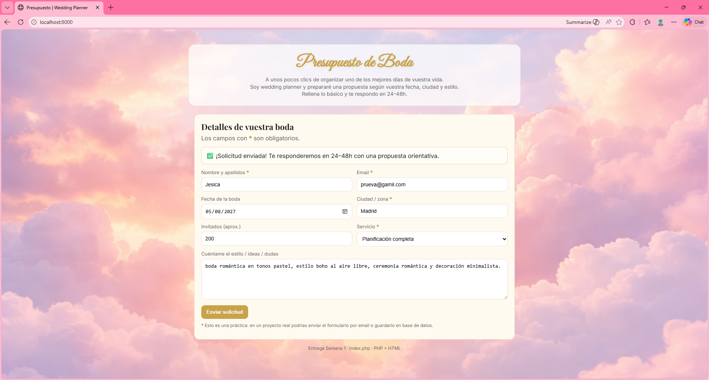

 📌 CodeNode · Semana 1 · Formulario PHP

## 🌐 Demo online

🔗 **Ver formulario funcionando:**  
https://codenodesemana1.infinityfreeapp.com

Descripción

En esta práctica se pedía crear una página HTML válida y semántica con un formulario que procesara la información mediante PHP y mostrara un mensaje de respuesta.

Para hacerlo más realista he decidido no crear el típico formulario de registro o contacto, sino un formulario de solicitud de presupuesto para una wedding planner, ya que es un caso más cercano a lo que suelen pedir las empresas.

El formulario está hecho en un único archivo index.php, recoge los datos mediante POST, los procesa en el servidor y muestra un mensaje de éxito o error en la misma página.

🧠 Objetivo de aprendizaje

Durante esta semana me he centrado en entender los fundamentos de PHP, no solo en que el formulario funcione.

He trabajado el flujo completo:

Recoger datos con $_POST

Limpiar valores con trim()

Validar campos obligatorios

Validar el formato del email con filter_var()

Mostrar un mensaje dinámico según el resultado

Mantener los datos escritos en los inputs tras el envío

También he aprendido qué significa sanitizar y he añadido una función con htmlspecialchars() para evitar la inyección de código malicioso.

🧱 Estructura

HTML semántico (header, main, section, footer)

Formulario organizado en una card

Mensajes de estado (éxito / error)

Persistencia de datos en los campos

codenode-semana1/
├── index.php
├── assets/
│   ├── nubesrosas.png
│   ├── image.png
│   └── image2.png
└── README.md

🎨 El CSS ha sido construido con apoyo de IA para crear una interfaz más cuidada.
🧩 El código PHP sí está escrito y comprendido por mí.

➕ Mejoras añadidas

✔ Validación de campos obligatorios en servidor
✔ Diferenciación visual entre mensajes de error y éxito
✔ Persistencia de datos tras el envío
✔ Diseño orientado a un caso real de negocio

🧩 Mejoras aplicadas tras la revisión

1 Separación del CSS en archivo externo

Inicialmente el CSS estaba dentro de index.php, pero se ha movido a assets/styles.css para mejorar la escalabilidad y el mantenimiento del proyecto.

De esta forma:

Se evita duplicar estilos si se añaden nuevas páginas

Se mantiene una separación clara entre estructura (HTML/PHP) y presentación (CSS)

Se facilita la reutilización del diseño en otros formularios

El archivo se enlaza desde el <head> mediante:

<link rel="stylesheet" href="assets/styles.css">

2 Validación en el lado del cliente (JavaScript)

Además de la validación en el servidor con PHP, se ha añadido una validación previa en JavaScript (assets/validacion.js).

Esto permite:

Detectar campos obligatorios vacíos antes de enviar el formulario

Validar el formato del email en el navegador

Mostrar mensajes de error sin recargar la página

Mejorar la experiencia de usuario

Si la validación del cliente falla, el formulario no se envía.
Si pasa la validación, entonces se procesa en el servidor con PHP.

De esta forma se implementa una doble capa de validación:

Frontend → mejora la UX

Backend → garantiza la seguridad y la integridad de los datos

🖼️ Capturas 

Captura del formulario funcionando

Captura del mensaje de validación

✍️ Comentarios personales

En esta práctica he trabajado la sintaxis básica de PHP y el flujo completo de un formulario.
He aprendido a recoger datos con GET y POST, validar campos obligatorios, comprobar el formato del email y usar trim() para eliminar espacios que podrían provocar errores.

También he entendido la importancia de sanitizar la salida con htmlspecialchars() para evitar la inyección de código malicioso.

Ahora comprendo mejor cómo funciona la comunicación cliente-servidor en un caso real y cómo controlar los datos antes de mostrarlos o utilizarlos.

🚀 Posibles mejoras futuras

Envío real del formulario por email

Guardado en base de datos

Mejorar tipografia general

👩‍💻 Jesica Serrano
CodeNode · 2026